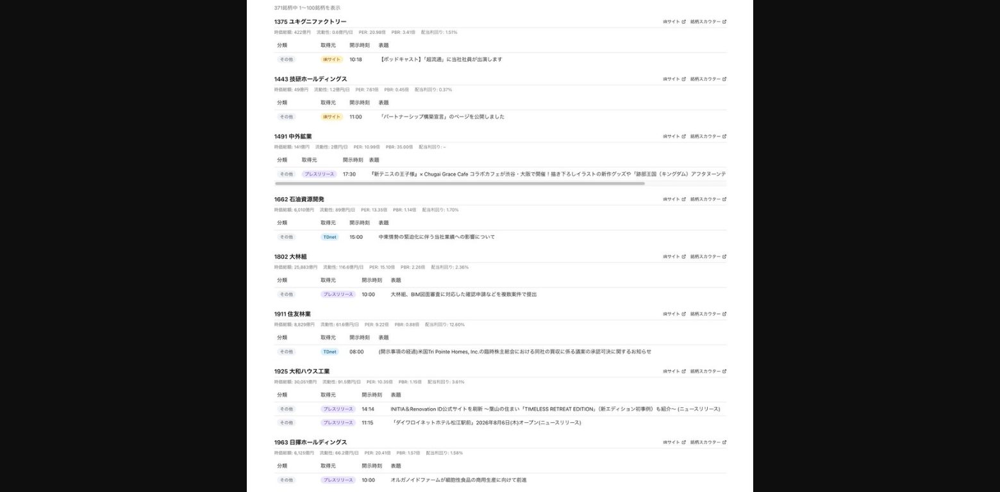

# IRサイトスクレイパー構想

## ステータス: 構想段階

## 背景・動機

TDnet適時開示だけでは企業の情報を取りこぼす。以下のような情報はTDnetに載らず、各社IRサイトにのみ掲載される:

- 月次売上情報
- 決算説明資料
- プレスリリース（業績示唆を含むもの）
- IRカレンダー・イベント告知
- パートナーシップ・コラボ告知
- M&A関連の補足資料

## 着想元

@daken_in_market (駄犬) のツイート 2026-04-17:
- https://x.com/daken_in_market/status/2045117181931954246
- https://x.com/daken_in_market/status/2045130200732865000

Claude Codeを使って自作したIRサイトスクレイパーの紹介。エンゲージメント（いいね245/ブックマーク150）から需要の高さが窺える。

## 参考アーキテクチャ（ツイート主の設計）

3段フォールバック構成:

1. **RSSフィード**: IRサイトにRSSがあればそこから取得（最も安定）
2. **汎用パーサー**: 一般的なIRページ構造に対応する共通パーサー
3. **個社パーサー**: 上記で失敗する企業向けの個別実装

ツイート主は「3.をちまちま実装するのは自分では面倒すぎて完璧ムリ」と述べており、Claude Codeで個社パーサーを量産したとのこと。

## レイアウト参考画像

## 添付画像から読み取れた仕様

- 企業ごとにプレスリリース・お知らせ・IRカレンダー等をカテゴリタグ（色分け）で一覧表示
- 表示項目: 銘柄コード、企業名、カテゴリタグ、公開日時、タイトル概要、IRサイトリンク
- 確認できた企業: 1375 ユキグニファクトリー、1443 技研ホールディングス、1451 中外鉱業、1662 石油資源開発、1802 大林組、1911 住友林業、1925 大和ハウス工業、1963 日揮ホールディングス

## 自プロジェクトとの接続点

- TDnet ETLパイプライン（DL→GCS→BQ）は既に稼働中
- TDnet外の情報を同じBQテーブル or 別テーブルに載せれば、既存の分析・通知基盤と統合可能
- 月次売上データは決算反応モデルの入力因子候補になりうる

## 検討事項（未整理）

- 対象企業の絞り込み基準（全上場？ポートフォリオ銘柄のみ？）
- RSS有無の事前調査
- 汎用パーサーの実現可能性（IRサイトの構造は企業ごとにバラバラ）
- 更新頻度・実行タイミング
- Gemini/LLMで非構造HTMLからの情報抽出は有効か
- 既存の優待スクレイパー（098）との設計共通化
